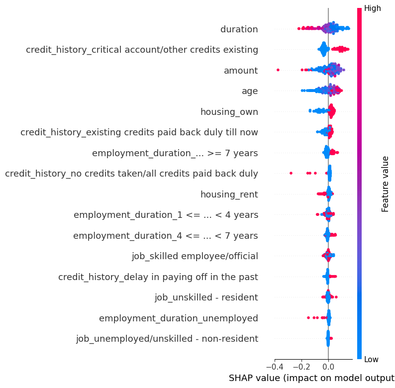
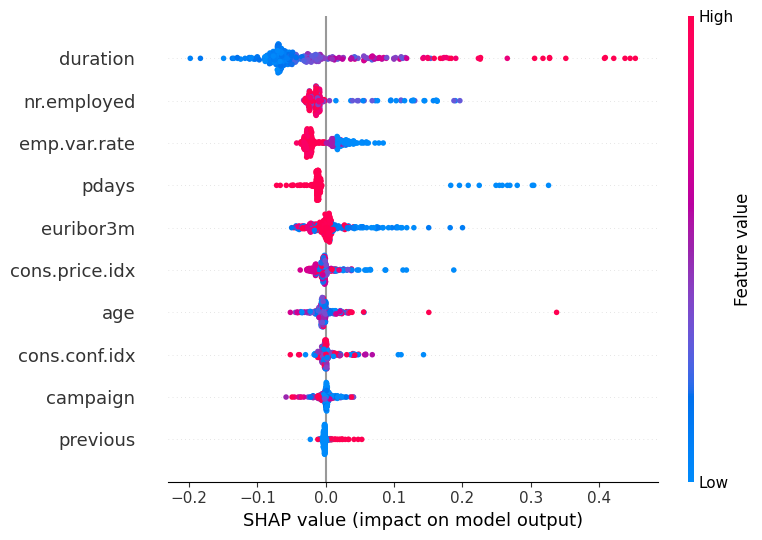

# Explainable AI & Fairness Analysis in Credit Decision Systems

> **Does domain context determine fairness risk more than the algorithm itself?**

A multi-dataset XAI pipeline using SHAP, LIME, and counterfactual analysis to investigate
how machine learning models make decisions in financial contexts — and what that means for
fairness, transparency, and EU AI Act compliance.

---

## Why This Matters

Modern AI systems used in credit scoring and financial decisions are **not evaluated on accuracy alone**.
They must also be:

- **Transparent** — decision logic must be interpretable by regulators and affected individuals
- **Fair** — reliance on protected characteristics (age, gender) creates discrimination risk
- **Accountable** — under EU AI Act Annex III, credit scoring is explicitly classified as **high-risk**

This project demonstrates that **the same algorithm produces fundamentally different fairness risk profiles**
depending on the dataset domain — not because of the algorithm, but because of what each domain rewards.

---

## Research Question

> When the same machine learning algorithm is applied to two different financial datasets,
> does the domain context determine whether the model is inherently fairness-risky —
> independent of the algorithm chosen?

---

## Key Findings

| Finding | Result |
|---------|--------|
| **German Credit** primary CF-sensitive feature | `amount` (38% flip rate at ×0.3), `age` second (26%) |
| **Bank Marketing** primary driver | `duration` — behavioral characteristic (max 2% flip rate) |
| **German Credit** test accuracy | 0.695 (CV: 0.690 ± 0.024, ROC-AUC: 0.682) |
| **Bank Marketing** test accuracy | 0.863 (CV: 0.903 ± 0.008, ROC-AUC: 0.831) |
| Accuracy vs fairness risk | Higher CV accuracy (Bank: 0.903) does **not** mean lower fairness risk |
| Core insight | Fairness risk is **domain-dependent**, not algorithm-dependent |

---

## Datasets

### German Credit Dataset

| Property | Value |
|----------|-------|
| Source | https://raw.githubusercontent.com/selva86/datasets/master/GermanCredit.csv |
| Size | 1,000 instances, 16 features (after preprocessing) |
| Train / Test | 800 / 200 (stratified) |
| Class balance (test) | Good=140 (70%) / Bad=60 (30%) |
| Task | Credit risk prediction (Good / Bad) |
| Sensitive attribute | `age` (protected demographic characteristic) |
| License | CC BY 4.0 |

### Bank Marketing Dataset

| Property | Value |
|----------|-------|
| Source | https://raw.githubusercontent.com/selva86/datasets/master/bank-full.csv |
| Size | 1,500 sampled instances, 10 features (after preprocessing) |
| Train / Test | 1,200 / 300 (stratified) |
| Train / Test | 1,200 / 300 (stratified) |
| Class balance (test) | No=265 (88%) / Yes=35 (12%) |
| Task | Predict term deposit subscription (Yes / No) |
| Key feature | `duration` (call length — behavioral signal) |
| License | CC BY 4.0 |

---

## Methodology

### Pipeline Overview

```
Raw Data → Preprocessing → Model Training (Random Forest)
    ↓
SHAP (Global Explainability)      → Which features matter across all predictions?
LIME (Local Explainability)       → Why was this specific prediction made?
Counterfactual Analysis           → What minimal change flips the prediction?
    ↓
Cross-Dataset Comparison → Fairness Risk Assessment → EU AI Act Alignment
```

### Model

- **Algorithm:** Random Forest Classifier
- **Validation:** 5-fold stratified cross-validation (not just single train/test split)
- **Trained independently** on each dataset for controlled comparison

### Explainability Techniques

| Method | Scope | Key Question |
|--------|-------|-------------|
| **SHAP** | Global + Local | Which features drive decisions across all predictions? |
| **LIME** | Local only | Why was this individual prediction made? |
| **Counterfactual** | Decision boundary | What is the minimum change to flip a prediction? |

---

## Results

### Model Performance

| Dataset | Test Accuracy | CV Accuracy | CV ROC-AUC | CV Fold Scores |
|---------|--------------|-------------|------------|----------------|
| German Credit | **0.695** | 0.690 ± 0.024 | 0.676 ± 0.021 | [0.700, 0.660, 0.665, 0.700, 0.725] |
| Bank Marketing | **0.863** | 0.903 ± 0.008 | 0.910 ± 0.010 | [0.897, 0.900, 0.893, 0.917, 0.907] |

### Test Set ROC-AUC

| Dataset | Test ROC-AUC | Interpretation |
|---------|-------------|----------------|
| German Credit | **0.682** | Moderate discrimination ability |
| Bank Marketing | **0.831** | Strong discrimination ability |

### Counterfactual Sensitivity — Top Features per Dataset

**German Credit — Top 5 most decision-sensitive features:**

| Feature | Perturbation Factor | Flip Rate | Interpretation |
|---------|-------------------|-----------|----------------|
| `amount` | ×0.3 | **38%** | Top sensitivity — loan amount near decision boundary |
| `age` | ×0.3 | **26%** | Protected characteristic — high fairness risk |
| `amount` | ×0.5 | 22% | Robust sensitivity across factors |
| `age` | ×0.5 | 20% | Age influence persists across perturbation levels |
| `amount` | ×0.7 | 18% | Still sensitive even at mild perturbation |

**Bank Marketing — Top features (much lower sensitivity):**

| Feature | Max Flip Rate | Interpretation |
|---------|--------------|----------------|
| `age` / `duration` / `euribor3m` / `nr.employed` | **2%** | Very low boundary sensitivity — model is robust |

> **Critical finding:** German Credit is far more decision-sensitive than Bank Marketing
> (38% vs 2% max flip rate). This reflects how much closer German Credit predictions
> sit to the decision boundary — small changes in loan amount or age can flip outcomes.

> A "flip rate" is the proportion of predictions that change when a feature is
> reduced by a given factor. Higher flip rate = the model's decision boundary
> is closer to this feature — small real-world differences change outcomes.

---

## SHAP Explainability Visualizations

### German Credit Dataset — Feature Importance

Age is the dominant decision driver — a **protected demographic characteristic** under GDPR and EU AI Act.



*Each dot represents one prediction. Red = high feature value, Blue = low feature value.
Horizontal position shows whether the feature pushed the prediction positive or negative.*

---

### Bank Marketing Dataset — Feature Importance

Duration (call length) dominates — a **behavioral characteristic** with no inherent demographic correlation.



*Duration reflects genuine customer engagement. Unlike age, it is not a protected
characteristic — but it may be gameable (longer calls could be artificially extended).*

---

## Cross-Dataset Analysis: Why Decision Drivers Differ

### Core Finding

The same Random Forest algorithm, trained on two financial datasets, produces models with
**fundamentally different fairness risk profiles** — driven by what each domain rewards:

| Dataset | What the Domain Rewards | Top SHAP Feature | Test Accuracy | CV Accuracy | Fairness Risk |
|---------|------------------------|-----------------|--------------|-------------|---------------|
| German Credit | Credit history patterns correlated with age | `age` (demographic) | 0.695 | 0.690 ± 0.024 | **High** |
| Bank Marketing | Customer engagement during call | `duration` (behavioral) | 0.863 | 0.903 ± 0.008 | Lower |

### Why This Is Not an Algorithm Problem

If the algorithm were the cause of the fairness risk, we would expect to see
similar decision patterns across both datasets. Instead, the patterns are opposite:

- **German Credit** rewards *who you are* (demographic identity)
- **Bank Marketing** rewards *what you did* (behavioral engagement)

This is a **data and domain problem**, not an algorithm problem — which has profound
implications for how the EU AI Act should structure fairness auditing requirements.

### Why Explainability Alone Is Not Enough

SHAP tells us *that* `age` matters in German Credit decisions.  
It does **not** tell us *whether* this is acceptable.  
That judgment requires regulatory frameworks, domain expertise, and ethical reasoning —
not just technical explainability tools.

---

## EU AI Act Alignment

Credit scoring is **explicitly listed as high-risk** in EU AI Act Annex III.

| EU AI Act Article | Requirement | This Project's Evidence |
|------------------|-------------|------------------------|
| Art. 10 | Data governance | SHAP identifies `age` as dominant in German Credit — protected characteristic detected |
| Art. 13 | Transparency | Three-method XAI audit (SHAP + LIME + Counterfactual) provides interpretable trail |
| Art. 14 | Human oversight | Counterfactual heatmap shows where human review is most critical — German Credit `amount` at 38%, `age` at 26% flip rate |
| Art. 15 | Accuracy & robustness | 5-fold CV: German 0.690 ± 0.024, Bank 0.903 ± 0.008 — low variance confirms stability |

---

## Configuration

All pipeline settings are in `config.py` — change datasets, model parameters, and
explainability behavior without modifying core code.

| Parameter | Type | Default | Description |
|-----------|------|---------|-------------|
| `DATASETS` | list | `['german', 'bank']` | Which dataset(s) to run |
| `DATASET_CONFIG` | dict | — | Per-dataset settings (sample size, file path) |
| `MODEL_CONFIG` | dict | `n_estimators=100` | Random Forest hyperparameters |
| `SPLIT_CONFIG` | dict | `test_size=0.2` | Train/test split ratio and random seed |
| `OUTPUT_CONFIG` | dict | `save=True` | Controls saving of plots and CSVs |
| `EXPLAINABILITY_CONFIG` | dict | all enabled | Toggle SHAP, LIME, counterfactual per run |

---

## Tech Stack

| Library | Purpose |
|---------|---------|
| `scikit-learn` | Model training, cross-validation, metrics |
| `shap` | Global and local feature importance |
| `lime` | Instance-level local explanations |
| `pandas`, `numpy` | Data manipulation |
| `matplotlib`, `seaborn` | Visualisation |

**Python version:** 3.8+

---

## Project Structure

```
XAI_Credit_Risk/
│
├── data/ 
│   ├── Bank_marketing.csv              
│   └── German_credit.csv
├── notebooks/
│   └── 01_XAI_analysis.ipynb   ← Full analysis pipeline (start here)
├── src/
│   ├── data_loader.py       ← Dataset loading functions
│   ├── preprocessing.py     ← Feature engineering and encoding
│   ├── model.py             ← Model training and evaluation
│   └── explain_shap.py      ← SHAP computation wrapper
├── outputs/                 ← Generated plots and CSVs
│   ├── shap_german.png
│   ├── shap_bank.png
│   ├── shap_comparison.png
│   ├── counterfactual_sensitivity.png
│   ├── counterfactual_heatmap.png
│   ├── cross_dataset_dashboard.png
│   └── comparison_results.csv
├── findings.md              ← Standalone research findings document
├── main.py                  ← Pipeline entry point
├── config.py                ← All configuration parameters
├── README.md
└── requirements.txt
```

---

## How to Run

### Step 1 — Install dependencies

```bash
pip install -r requirements.txt
```

> Requires Python 3.8+. Recommended: create a virtual environment first.

### Step 2 — Download datasets

### Step 3 — Run the pipeline

```bash
python main.py
```

### Step 4 — Explore the notebook

Open `notebooks/01_XAI_analysis.ipynb` for the full step-by-step analysis with
explanations, visualisations, and research interpretation.

---

## Limitations

**Technical:**
- SHAP assumes feature independence — correlated features may have misleading importance scores
- LIME explanations are locally linear and may not reflect global model behaviour
- Counterfactual analysis only perturbs features downward — upward perturbations not tested
- German Credit has only 1,000 instances — results may not generalise to larger populations

**Methodological:**
- Only one model architecture (Random Forest) tested — results may differ for gradient boosting or neural networks
- "Fairness risk" is assessed qualitatively — a companion quantitative audit using Fairlearn is in [`AI_Fairness_Loan_Audit`](https://github.com/Saurabh-pilaniya07/AI_Fairness_Loan_Audit)
- Counterfactual analysis uses 50 test samples — larger sample would increase confidence

**Scope:**
- This project shows *which* features drive decisions — not *whether* those decisions violate any specific regulation (that requires legal analysis)
- SHAP reveals correlation-based importance, not causal relationships

---

## Related Work

This project builds on and connects to:

- Ribeiro et al. (2016) — *"Why Should I Trust You?": Explaining the Predictions of Any Classifier* (LIME)
- Lundberg & Lee (2017) — *A Unified Approach to Interpreting Model Predictions* (SHAP)
- Wachter et al. (2017) — *Counterfactual Explanations Without Opening the Black Box*
- Doshi-Velez & Kim (2017) — *Towards A Rigorous Science of Interpretable Machine Learning*

---

## Portfolio Context

This project is **Part 2 of a 3-part Responsible AI portfolio**:

| Project | Focus | Repository |
|---------|-------|-----------|
| Part 1 | Fairness & Bias Mitigation | [AI_Fairness_Loan_Audit](https://github.com/Saurabh-pilaniya07/AI_Fairness_Loan_Audit) |
| **Part 2** | **Explainability (XAI)** | **This repository** |
| Part 3 | AI Governance & EU AI Act | *(Coming soon)* |

The combined portfolio demonstrates a transition from *"building models"*
to *"building responsible AI systems"* across technical, interpretability, and governance dimensions.

---

## Research Positioning

This work moves beyond asking *"How accurate is the model?"* to asking:

> *"How does the model make decisions — and is that acceptable?"*

**Technical contribution:** A reproducible multi-dataset XAI pipeline comparing SHAP,
LIME, and counterfactual analysis across two financial domains with fairness risk framing.

**Research contribution:** Evidence that fairness risk is domain-dependent, not
algorithm-dependent — suggesting that EU AI Act fairness auditing requirements
should be domain-specific rather than generic.